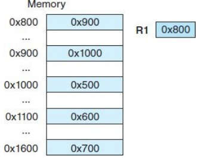
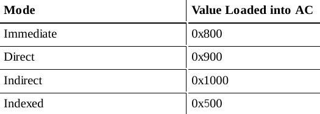
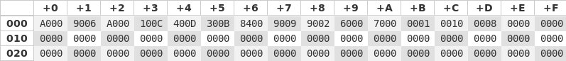

% MARIE Examples
% Sebastien Bah
% March 2019

# Memory Preamble
A few things before we get into MARIE

- Endianness
- Types of Addressing

## Endianness
Assume we want to store a 4 Byte integer: **ABCDEF01**.

How would you place it in memory? (X is a memory address, X+1 is the next one,...)

## ABCDEF01
| Endianness    	|  X 	| X+1 	| X+2 	| X+3 	|
|---------------	|:--:	|-----	|-----	|-----	|
| Big Endian    	| AB 	| CD  	| EF  	| 01  	|
| Little Endian 	| 01 	| EF  	| CD  	| AB  	|

**Note that the order of the Bytes change, not the content of the Bytes**


## Addressing Modes

Best shown with an example, Let us say the operation was *LOAD 800*, consider it through the following modes (result goes into the AC).


- **Immediate** [take values as is]
- **Direct** [value to load is at address given]
- **Indirect**  [address given leads to address of where the value is stored]
- **Indexed** [add the value given in the command with the value of a register, result is effective address]

-------------------------





# Setup

Things you will need:

- [Documentation](https://github.com/MARIE-js/MARIE.js/wiki/MARIE-Instruction-Set-(with-Opcodes))
- [Simulator](https://marie.js.org/#)

# Multiplication
How do you multiply? Let's say you want to do $x = 5x+y$ ?

Write a quick function?

## Code
```{include=files/MultiplicationEmpty.mas}
```

## Candidate
```{include=files/Multiplication.mas}
```

# Jumps
```{include=files/Jumps.mas}
```

# Subroutines
*Recall*:

- **JnS**  --> *Stores* the value of PC at address X and *Jumps* to X+1      
- **JumpI** --> Uses the *value at the memory address X* as the addres to *Jump* to 

## Code
```{include=files/Subroutine.mas}
```

# Skip conditions
*Recall*:

- Skipcond 000 -> Skips next line if $AC<0$
- Skipcond 400 -> Skips next line if $AC=0$
- Skipcond 800 -> Skips next line if $AC>0$

## Code
```{include=files/Skips.mas}
```


# Loops
Let's do the multiplication function $x = Nx+y$ but with loops.

(Tools needed: Jump and Skipcond)

## Code
```{include=files/LoopMultiply.mas}
```

# Decoding Memory Content
Given that the starting value of $PC=000$, what does this program do?



## Code
```{include=files/decodingMemoryContent.mas}
```

# Finding the unknown
What is the value of UNKNOWN for the function to be  $A = 2Y - Z$ 

## Code
```{include=files/UnknownValue.mas}
```


# Array
```{include=files/ArrayMarie.mas}
```
